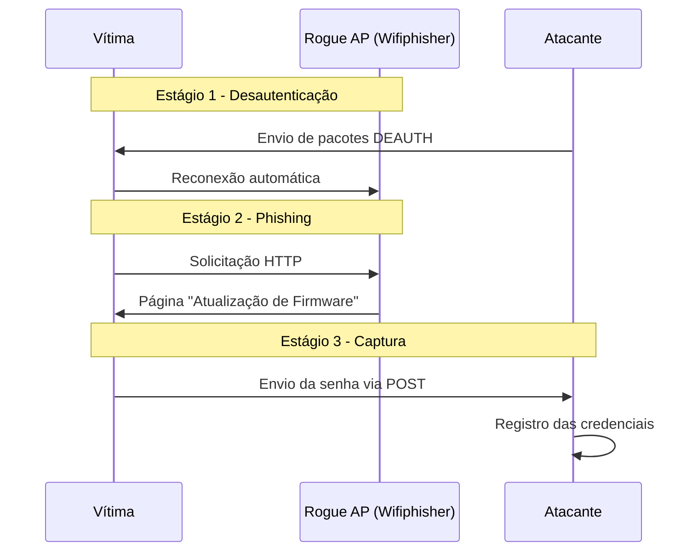

# 🔐 Exploração de Vulnerabilidades em Redes Wireless com Rogue AP e Captura WPA/WPA2 via Wifiphisher

<div align="center">

## ⚠️ AVISO LEGAL (DISCLAIMER)

Este repositório foi produzido **exclusivamente para fins acadêmicos** na disciplina de **Redes de Computadores II**.  
Todos os testes foram realizados em ambiente isolado, com dados fictícios e com autorização, seguindo as práticas de segurança do curso.

</div>

---

# 📑 1. Sumário Executivo

Este projeto apresenta uma **Prova de Conceito (PoC)** sobre exploração de vulnerabilidades em redes Wi-Fi por meio de um **Rogue Access Point (AP)** e captura de credenciais **WPA/WPA2** através de engenharia social usando a ferramenta **Wifiphisher**.

O cenário demonstra como usuários podem ser levados a inserir a senha do Wi-Fi acreditando realizar uma atualização legítima do roteador, quando na verdade estão conectados a um ponto de acesso falso.

---

# 🎯 Objetivos

- Criar e configurar ambiente controlado para exploração de redes wireless.  
- Utilizar o **Wifiphisher** para criar um Rogue AP com cenário de phishing.  
- Capturar requisições HTTP enviadas pela vítima.  
- Registrar credenciais fornecidas voluntariamente.  
- Gerar PCAP e documentação completa.  
- Apresentar contramedidas eficazes.

---

# 🏗️ 2. Arquitetura e Topologia

O ambiente foi construído utilizando hardware real, com placa Wi-Fi em modo monitor.

### **Componentes Utilizados**

| Componente | Especificação | Função |
|-----------|----------------|--------|
| Notebook com Kali Linux | Kali + Placa USB Wi-Fi (modo monitor) | Atacante — cria AP falso e coleta tráfego |
| Wifiphisher | Versão 1.4 GIT | Criação do AP falso + phishing |
| Dispositivo Vítima | Smartphone Android | Conecta ao AP falso e envia credenciais |

---

# ⚙️ 3. Metodologia

## 3.1 Preparação da Interface (Modo Monitor)

```bash
sudo ifconfig wlan0 down
sudo iwconfig wlan0 mode monitor
sudo ifconfig wlan0 up
```

---

## 3.2 Execução do Wifiphisher

```bash
sudo wifiphisher --force-hostapd
```

Etapas:

- Wifiphisher escaneia redes próximas.  
- Escolha do SSID-alvo: **Sineyda (ambiente de laboratório)**  
- Cenário selecionado: **Firmware Upgrade Page**  
- Página falsa solicita senha WPA/WPA2.

---

# 🔄 4. Ciclo de Vida do Ataque



---

# 📝 5. Análise Técnica

## 📡 Estágio 1: DEAUTH Attack
Pacotes de desautenticação forçam a vítima a se desconectar da rede legítima, conectando-se automaticamente ao AP falso.

## 🎭 Estágio 2: Rogue AP + Phishing
A página falsa exibe mensagem solicitando atualização de firmware:

> *"Insira a senha WPA/WPA2 para continuar."*

## 🔓 Estágio 3: Captura da Senha

Exemplo capturado:

```txt
POST request from 10.0.0.32 with wfphshr-wpa-password=teste
```

---

# 📸 6. Evidências

### 6.1 Seleção do SSID alvo  
<div align="center"></div>

### 6.2 Cenário de phishing  
<div align="center"></div>

### 6.3 Captura da senha  
<div align="center"></div>

---

# 📊 7. Classificação dos Dados Comprometidos

| Dado Capturado | Tipo | Risco | Impacto Técnico |
|----------------|------|--------|-----------------|
| Senha WPA/WPA2 | Credencial | **Crítico** | Acesso total ao roteador |
| Modelo/OS | Metadados | Médio | Fingerprinting |
| Tráfego HTTP | Metadados | Baixo | Identificação de comportamento |

---

# 🛡️ 8. Contramedidas e Recomendações

## 🔐 Camada Wireless
- Migrar para **WPA3-Personal**  
- Desativar **WPS**  
- Atualizar firmware apenas pela interface oficial  

## 🎛️ Detecção de Rogue APs
Ferramentas recomendadas:
- **Kismet**
- **Airgeddon**
- **WIDS/WIPS** corporativos

## 🌐 Boas Práticas do Usuário
- Nunca inserir senha do Wi-Fi em páginas externas  
- Validar IP do gateway  
- Evitar redes públicas  

---

# 🛠️ 9. Guia Completo de Reprodução

## 📌 Requisitos
- Kali Linux  
- Placa Wi-Fi com monitor mode  
- Wifiphisher  
- Wireshark (opcional)  

## 📌 Passos do Ataque
1. Ativar modo monitor  
2. Rodar Wifiphisher  
3. Selecionar SSID  
4. Escolher cenário **Firmware Upgrade**  
5. Aguardar captura da chave  

## 📌 Arquivo PCAP
Incluído: **captura.pcapng**

---

# 🔚 10. Finalização do Experimento

O experimento demonstrou a eficácia do Rogue AP combinado com engenharia social.  
A vítima acreditou estar realizando atualização legítima, mas forneceu a chave WPA ao atacante.

Reforça-se a necessidade de:
- Padrões modernos (**WPA3**)  
- Conscientização de usuários  
- Monitoramento contínuo contra APs maliciosos  

---

<div align="center">

### 👨‍💻 Desenvolvido por:
**Guilherme Ferreira**  
**João Pedro**  
**Danyel**  
**Gabriel**

Curso de Sistemas de Informação — **Novembro/2025**

</div>
